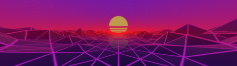
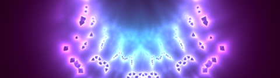
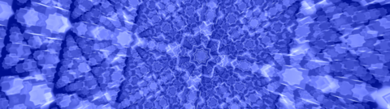
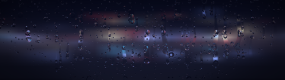
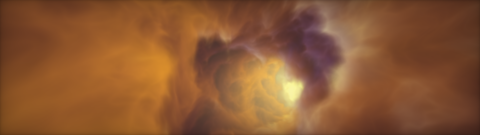
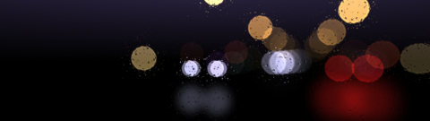
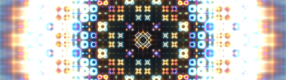
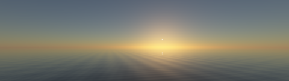

# 5H4D3R5

Plugin id: `builtin.5h4d3r5`

## Screenshot


## What it does

A full-screen animated shader or demo from a bundled catalog, all compiled into the plugin at build time (nothing is downloaded or compiled while RedXe runs). Today the catalog holds twelve works ported from [Shadertoy](https://www.shadertoy.com), RedXe's own Cosmic Orb, and a physically based sky built on Sébastien Hillaire's atmosphere technique. The tile can show one shader you choose, one picked at random when the tile starts, or a slideshow that steps through the whole catalog. Every change fades through the dashboard background. Both shipped templates end with a full-canvas **Shaders** page.

In `slideshow` mode a **left click or a tap on the tile skips to the next shader** right away (the current one fades out, the next fades in), wrapping around at the end of the catalog; a drag does nothing. Because that click belongs to the widget, a slideshow tile is not raised by double-click; use a `widget.toggle` action (see [Actions](../actions.md)) if you want a small slideshow tile full-window. In `single` and `random` modes clicks are left to the host, so double-click or double-tap raises the tile as usual.

The catalog is fixed; the widget cannot load a shader from a file or a URL.

## Parameters

All members are optional in the file; omitted keys take these defaults. Unknown keys reject the document. The shader fades from the dashboard `backgroundColor`; to change it for this widget only, put `backgroundColor` on the widget object (see [usage](../usage.md#background-color)).

| Parameter | Type | Range | Default | Meaning |
| --- | --- | --- | --- | --- |
| `mode` | string | `single`, `random`, `slideshow` | `slideshow` | `single` always shows `shader`; `random` picks one shader when the tile is created and keeps it; `slideshow` shows every shader in turn, and a click or tap skips to the next one |
| `shader` | string | a name from the [catalog](#bundled-shaders) below | `seascape` | The shader for `single`, and the first slide of a sequential slideshow |
| `intervalSeconds` | integer | 10–3600 | `120` | How long each slide stays before the next one fades in |
| `shuffle` | boolean | `true`, `false` | `false` | Slideshow order: `false` follows the catalog order from `shader`; `true` shuffles the catalog every round (each shader once per round) |
| `renderScalePercent` | integer | 25–100 | `50` | Resolution the shader is computed at, as a percentage of the tile, then upscaled. Several of these shaders ray-march every pixel; at the full 2560×720 canvas that costs a lot of GPU time, so half resolution is the default |

A single or random shader restarts its clock (through the same short fade) once an hour so the animation stays smooth over a long uptime.

```json
{
  "plugin": "builtin.5h4d3r5",
  "mode": "slideshow",
  "shader": "protean-clouds",
  "intervalSeconds": 60,
  "shuffle": true,
  "renderScalePercent": 50
}
```

## Bundled shaders

The `shader` name selects an entry; a sequential slideshow follows this order. Each picture is a live capture of the tile at the default settings (the two simulations after a few seconds of running).

| `shader` | Tile | Shader |
| --- | --- | --- |
| `fluid-solver` |  | [Fluid solver](https://www.shadertoy.com/view/XlsBDf) by David A Roberts (davidar). Single-pass Navier-Stokes fluid drawing ink trails; runs a feedback buffer |
| `cineshader-lava` |  | [CineShader Lava](https://www.shadertoy.com/view/3sySRK) by Edan Kwan (edankwan). Smooth-union metaballs |
| `synthwave-sunset` |  | [another synthwave sunset thing](https://www.shadertoy.com/view/tsScRK) by stduhpf. Pseudo-tessellation terrain under a synthwave sky |
| `seascape` |  | [Seascape](https://www.shadertoy.com/view/Ms2SD1) by Alexander Alekseev (TDM). Procedural ocean |
| `warp-fbm` |  | [Base warp fBM](https://www.shadertoy.com/view/tdG3Rd) by trinketMage. Domain-warped noise with a rose colormap |
| `fractal-pyramid` |  | [fractal pyramid](https://www.shadertoy.com/view/tsXBzS) by bradjamesgrant. Folded-space fractal |
| `octagrams` |  | [Octagrams](https://www.shadertoy.com/view/tlVGDt) by whisky_shusuky. Arabesque-inspired glowing boxes |
| `heartfelt` |  | [Heartfelt](https://www.shadertoy.com/view/ltffzl) by Martijn Steinrucken (BigWings). Rain on a window; RedXe draws its own night-street picture behind the glass instead of the Shadertoy stock photograph |
| `protean-clouds` |  | [Protean clouds](https://www.shadertoy.com/view/3l23Rh) by nimitz. Volumetric clouds |
| `drive-home` |  | [The Drive Home](https://www.shadertoy.com/view/MdfBRX) by Martijn Steinrucken (BigWings). Night traffic bokeh through a rainy windscreen |
| `flammes-vortex` |  | [Flammes 3 - Vortex](https://www.shadertoy.com/view/WsccDH) by athibaul. Vortex-street flame simulation; runs a feedback buffer |
| `neon-pulse` |  | [Neon Pulse Fractal](https://www.shadertoy.com/view/7csXD4) by bogdoslav. Pulsing neon fractal |
| `cosmic-orb` |  | Psychedelic Cosmic Orb, a RedXe demo shader (not from Shadertoy). A fractal-folded sphere ray-marched with volumetric glow and a shifting purple, cyan and gold palette |
| `sky-atmosphere` |  | Sky Atmosphere: a sun that rises, crosses the view and sets over a calm sea that mirrors the sky, every 150 s. The atmosphere is [Sébastien Hillaire's technique](https://github.com/sebh/UnrealEngineSkyAtmosphere) (EGSR 2020, Epic Games, MIT); the sea, camera and day cycle are RedXe's |

Each Shadertoy port keeps its author's original header and license text at the top of its `.hlsl` file under `Plugins/5H4D3R5/Shaders/`. Shadertoy's terms put any shader without a license of its own under the Creative Commons Attribution-NonCommercial-ShareAlike 3.0 Unported license, so **every Shadertoy port in this catalog is CC BY-NC-SA 3.0**: attribution is required, commercial use is not allowed, and derived versions must carry the same license. `cosmic-orb` is RedXe's own and follows the repository's terms; `sky-atmosphere` uses Epic Games' MIT-licensed atmosphere code with RedXe's scene. See [`Plugins/5H4D3R5/LICENSES.md`](../../Plugins/5H4D3R5/LICENSES.md) for the full notices.

Sound inputs of the originals are not reproduced, and mouse-driven parameters stay at their untouched (never clicked) values.
