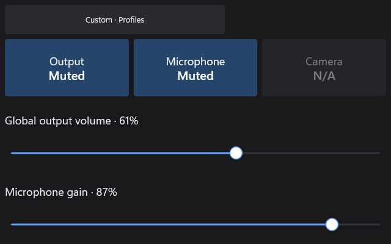

# AV Control

Plugin id: `builtin.av-control`

## Screenshot



## What it does

Live controls for **output mute**, **microphone mute**, and **camera off**, plus output and microphone levels. Profile selection is one tap at every supported size. **F6** opens profiles from the keyboard.

Smallest useful tile is 160×180 DIPs; every live target is at least 48×48 DIPs. Displayed mute and level state changes only after Windows confirms the action. Failure stays visible; it is never drawn as a successful mute or profile switch.

Profiles bind an output, a microphone, and a camera. Loading the dashboard does **not** apply hardware from those definitions. You choose a profile to apply it. Levels are 0–100. Mute is independent of level.

Camera setup inside the widget is guided steps for the separate RedXe Camera package. It does not install or prove that package by itself. Hardware, IME, and screen-reader acceptance are still tracked on the AV plan. When a profile, editor, or camera-setup view has more than one page, a row of dots at the bottom shows the current page.

One-finger touches stay with the widget so sliders and page dots work. Two or three fingers swipe RedXe dashboard pages.

Double-click or double-tap raises the widget to half the window.

## Parameters

Default is `{ "profiles": [] }`. Zero through four profiles. Compact settings must stay within 4096 bytes. Unknown keys, duplicate profile ids, or missing required fields reject the document.

| Parameter | Type | Limits | Meaning |
| --- | --- | --- | --- |
| `profiles` | array | 0–4 | Saved definitions only |
| `profiles[].id` | string | 1–32 `[A-Za-z0-9_-]+` | Stable id; case-insensitive unique |
| `profiles[].name` | string | 1–48 | Label |
| `profiles[].outputId` | string | 1–1024 | Opaque Windows output id |
| `profiles[].microphoneId` | string | 1–1024 | Opaque microphone id |
| `profiles[].cameraId` | string | 1–1024 | Opaque camera id |
| `profiles[].audioRoles` | string | `all` or `communications` | Which audio roles this profile matches |
| `profiles[].restoreLevels` | boolean | | Whether applying the profile writes the stored levels |
| `profiles[].outputLevel` | integer | 0–100 | Stored output percent |
| `profiles[].microphoneLevel` | integer | 0–100 | Stored microphone percent |

Shipped templates use an empty `profiles` array. Prefer editing profiles in the widget; the JSON ids are device-specific.

```json
{
  "plugin": "builtin.av-control",
  "settings": {
    "profiles": []
  }
}
```
