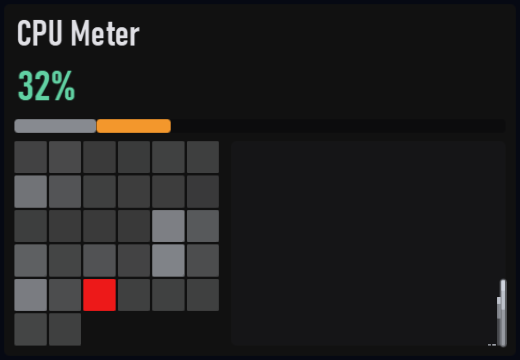

# CPU Meter

Plugin id: `builtin.cpu-meter`

## Screenshot



## What it does

Overall CPU use, a per-logical-processor heatmap, and a recency-faded history. Heatmap cells smaller than 6 px are dropped. Extra logical processors beyond the 64-cell cap show as `+N` at the bottom right. Amber from 70%, accent red from 85%. Double-click or double-tap raises it to a third of the window.

## Parameters

This widget has no parameters. `settings`, if present, must be `{}`.

```json
{ "plugin": "builtin.cpu-meter" }
```
