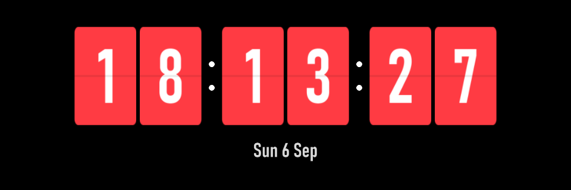

# Desk Clock

Plugin id: `builtin.desk-clock`

## Screenshot



## What it does

Local 24-hour `HH:MM:SS` on six flip cards, plus a compact English date (`Mon 6 Sep`). Changed digits flip; a jump of more than two seconds snaps to now. Double-click or double-tap raises it to half the window.

## Parameters

Omitted keys take these defaults. Colors are `#RRGGBB`. Unknown keys reject the document.

| Parameter | Type | Range | Default | Meaning |
| --- | --- | --- | --- | --- |
| `flipDurationMilliseconds` | integer | 250–800 | `420` | How long a digit flip lasts |
| `backgroundColor` | string | `#RRGGBB` | `#000000` | Opaque background |
| `cardColor` | string | `#RRGGBB` | `#FF3B43` | Card faces |
| `digitColor` | string | `#RRGGBB` | `#FFFFFF` | Time digits |
| `dateColor` | string | `#RRGGBB` | `#D8D8D8` | Date line |

```json
{
  "plugin": "builtin.desk-clock",
  "flipDurationMilliseconds": 500,
  "cardColor": "#FF3B43"
}
```
