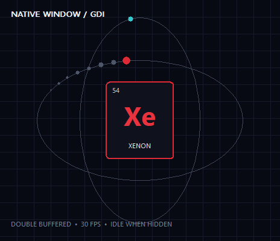

# GDI Orbit

Plugin id: `builtin.gdi-orbit`

## Screenshot



## What it does

A native child-window widget: a double-buffered GDI xenon orbit at 30 FPS while visible. It is the bundled example of a window widget (not Direct3D). Double-click or double-tap raises it to a quarter of the window.

It is not placed on any shipped page. A native child window sits above the Direct3D surface, so while one is on the current page Windows composes the whole RedXe window instead of flipping it directly to the display, which costs latency and DWM work. Add it yourself when you want the demo; raised, it covers the close control, so use Escape or a second double-activate to restore it.

Drops intended for a GPU tile (for example Launcher) are not stolen by this child.

## Parameters

This widget has no parameters. `settings`, if present, must be `{}`.

```json
{ "plugin": "builtin.gdi-orbit" }
```
