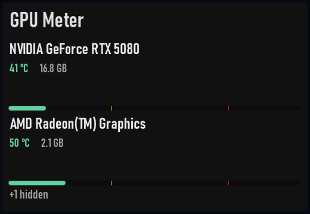

# GPU Meter

Plugin id: `builtin.gpu-meter`

## Screenshot



## What it does

Graphics adapters (not NPUs) with utilization, memory, and temperature when Windows publishes them. Missing sensors show muted dashes, not zeros. When adapters do not fit, a row of page dots appears at the bottom; tap a dot, swipe, or scroll to page them. Adapters that are not graphics devices are counted as `+N` at the bottom right. Double-click or double-tap raises it to a third of the window.

## Parameters

This widget has no parameters. `settings`, if present, must be `{}`.

```json
{ "plugin": "builtin.gpu-meter" }
```
