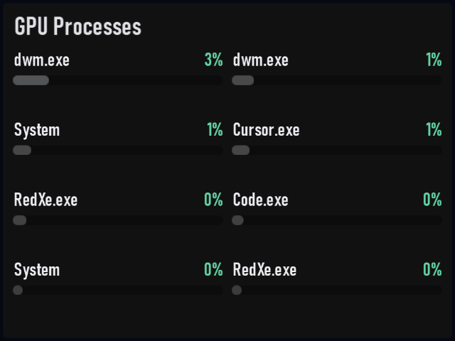

# GPU Processes

Plugin id: `builtin.gpu-processes`

## Screenshot



## What it does

Ranks processes by GPU engine use and joins image names from the process list. Same visual language as Process Viewer, including the page dots when more processes exist than fit. Double-click or double-tap raises it to half the window.

## Parameters

| Parameter | Type | Range | Default | Meaning |
| --- | --- | --- | --- | --- |
| `topN` | integer | 1–16 | `8` | How many rows to keep |

```json
{ "plugin": "builtin.gpu-processes", "topN": 8 }
```
