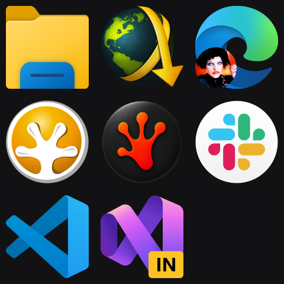

# Launcher

Plugin id: `builtin.launcher`

## Screenshot



## What it does

A grid of up to 32 shortcuts. Click an icon to launch it with the Windows default verb (no confirmation UI). Drag a file or a full URL onto the tile to append a shortcut, up to 32.

If there are too many shortcuts for the chosen icon size, Launcher splits them across internal pages. A row of small dots appears at the **bottom of the launcher tile**, not at the dashboard edge. Default `iconSize` is `"huge"`: icons stay a fixed jumbo size (192 DIP) and extra shortcuts go to the next page. `"small"` (72 DIP), `"medium"` (96 DIP), and `"large"` (144 DIP) keep that uniform icon size on a regular grid. When the tile is taller or wider than the icons need, leftover space becomes even gaps around and between icons instead of a tight cluster in the middle, with at least 8 DIP between icon edges. `"automatic"` starts at huge and shrinks toward small so more icons fit, then paginates only after the 72 DIP floor still cannot hold every shortcut. Swipe horizontally with one finger and the icons follow your finger, then ease to the next page — or tap a dot to slide there. The dots stay at the bottom. Two or three fingers still change RedXe dashboard pages.

An empty `shortcuts` list imports up to 32 current-user **taskbar pins** the first time the widget becomes visible, then saves them as this instance's list. After that, the saved list is authoritative and is not reimported. An empty or missing pin folder does not write settings.

Clicking padding (not an icon) can still raise the widget. Icon clicks launch and do not raise. Double-click or double-tap empty space raises it to half the window.

## Parameters

Default is `{ "shortcuts": [], "iconSize": "huge" }`. Unknown keys, relative paths, empty targets, duplicate targets, unknown `iconSize` values, or more than 32 items reject the document.

| Parameter | Type | Limits | Meaning |
| --- | --- | --- | --- |
| `iconSize` | string | `small`, `medium`, `large`, `huge`, or `automatic` | Uniform 72 / 96 / 144 / 192 DIP icon edges on a regular grid, or shrink from huge toward small then page |
| `shortcuts` | array | 0–32 items | Ordered shortcuts |
| `shortcuts[].target` | string | 1–512 bytes | Absolute Win32 path (`C:\...` or `\\server\share\...`) or a URI with a two-or-more-letter scheme (`https:...`) |
| `shortcuts[].iconPng` | string | 0–260 bytes | Optional absolute PNG icon path |

```json
{
  "plugin": "builtin.launcher",
  "shortcuts": [
    { "target": "C:\\Windows\\explorer.exe" },
    { "target": "https://www.corsair.com" }
  ]
}
```
