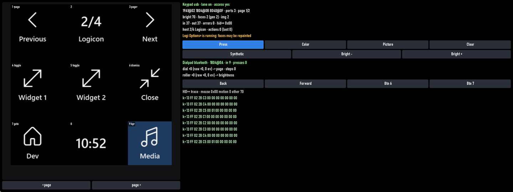

# Logicon (MX Creative Console)

Plugin id: `builtin.logicon` (a background service, configured under `services`, not placed on a page)

Debug tile id: `builtin.logicon-monitor` (developer builds only)

## Screenshot



The picture shows the Debug monitor tile; in a normal build there is nothing to see on the dashboard. What you see is the keypad itself: nine key faces, the two page buttons, and the dashboard reacting to them.

## What it does

Plug a Logitech MX Creative Console keypad into the PC and RedXe takes it over: each of the nine LCD keys shows an icon and a label you choose, and pressing a key navigates dashboard pages, raises or dismisses a widget, launches a program or link, or sends a media key (mute, play/pause, volume, next/previous track). Keys can also show the time or the current page number. The two arrow buttons under the keys either flip between your key pages or move between dashboard pages.

Quit **Logi Options+** first (or remove the keypad from its profile). Both programs can talk to the keypad at once, but Options+ keeps repainting the keys with its own icons, so the faces fight. RedXe never closes Options+ for you; it only logs a warning when it sees it.

Unplugging and replugging the keypad is fine: the faces come back by themselves. On exit RedXe restores the keypad's own button behavior and, by default, its start-up logo.

The MX Creative **Dialpad** works too when it is paired over Bluetooth: turning the dial or the roller can flip dashboard pages, change the volume, switch key pages, or dim the keypad, and each of its four buttons can do anything a key can. Buttons you do not bind keep their normal meaning (Back, Forward, …), and the dial and roller keep scrolling whatever is under the mouse pointer while they drive RedXe. A dialpad paired through a Logi Bolt receiver is not read.

Keys can also show live numbers: the CPU, memory, or GPU load, taken from the System Data plugin once a second.

## Parameters

Put one `Logicon` entry under `services`. Omitted keys take these defaults. Unknown keys reject the document.

| Parameter | Type | Values | Default | Meaning |
| --- | --- | --- | --- | --- |
| `brightness` | integer | 1–100 | `70` | Key panel brightness |
| `restoreLogoOnExit` | boolean | | `true` | Show the Logi logo again when RedXe exits |
| `pageButtons` | string | `keyPages`, `dashboardPages` | `keyPages` | What the two arrow buttons do |
| `keys` | array | up to 36 objects | `[]` | One entry per key face |
| `dialpad` | object | see below | nothing bound | What the dialpad's dial, roller, and buttons do |

Each `keys` entry:

| Key | Type | Values | Default | Meaning |
| --- | --- | --- | --- | --- |
| `page` | integer | 0–3 | `0` | Key page this entry belongs to (up to four pages of nine keys) |
| `slot` | integer | 0–8 | required | Key position, left to right then top to bottom |
| `action` | string | see below | `none` | What a press does |
| `target` | string | ≤ 512 bytes | `""` | Argument for the action |
| `label` | string | ≤ 16 characters | `""` | Text under the icon |
| `icon` | string | glyph name or `png:<absolute path>` | `""` | Picture on the key |
| `color` | string | `#RRGGBB` | dashboard background | Key background |
| `face` | string | `none`, `clock`, `pageIndicator`, `cpu`, `memory`, `gpu` | `none` | A live face instead of a static icon: the time, the page number, or a load percentage (label defaults to `CPU`, `MEM`, `GPU`) |

Actions and their `target`:

| `action` | `target` | Effect |
| --- | --- | --- |
| `page.next` / `page.previous` | none | Slide to the next / previous dashboard page |
| `page.goto` | a page `id` from `pages` | Jump to that page |
| `widget.raise` / `widget.toggle` | `"<ordinal>"` or `"<pageId>/<ordinal>"` (0-based position on the current page) | Raise that widget; `toggle` dismisses it when it is already raised |
| `widget.dismiss` | none | Close the raised widget |
| `launch` | `C:\...`, `\\server\share\...`, or `https://...` | Open it with the shell |
| `keys` | `volume-up`, `volume-down`, `mute`, `play-pause`, `next-track`, `previous-track` | Send that media key |
| `keyPage.next` / `keyPage.previous` | none | Switch to the next / previous key page |

The `dialpad` object:

| Key | Type | Values | Default | Meaning |
| --- | --- | --- | --- | --- |
| `dial` | string | `none`, `volume`, `page`, `keyPage`, `brightness` | `none` | One notch of the big dial: volume up/down, next/previous dashboard page, next/previous key page, or keypad brightness ±5 |
| `roller` | string | same values | `none` | One notch of the small roller |
| `buttons` | array | up to 4 objects | `[]` | Bindings for Back (`0`), Forward (`1`), Button 6 (`2`), Button 7 (`3`) |

Each `buttons` entry has a required `button` (0–3) and the same `action` and `target` as a key. A bound button is taken over by RedXe (an entry with no `action` silences it); an unbound one keeps its normal meaning.

Icons are Segoe Fluent Icons glyph names: `ChevronLeft`, `ChevronRight`, `Back`, `Forward`, `Home`, `Settings`, `Play`, `Pause`, `Stop`, `Next`, `Previous`, `Volume`, `Mute`, `Microphone`, `Camera`, `Video`, `Search`, `Refresh`, `Sync`, `Add`, `Remove`, `Cancel`, `Accept`, `Pin`, `Folder`, `Document`, `Link`, `Lock`, `Power`, `Brightness`, `Keyboard`, `Mouse`, `Globe`, `Mail`, `Calendar`, `Clock`, `Info`, `Warning`, `Error`, `Help`, `Star`, `Heart`, `FullScreen`, `BackToWindow`, `Save`, `Share`, `Copy`, `Undo`, `Redo`, `Diagnostic`, `AllApps`, `Map`, `Music`, `Photo`, `Headphone`, `Phone`, `Print`, `Tag`, `Bookmarks`, `Repair`, `Cloud`, `Download`, `Upload`, `Delete`, `Edit`, `Filter`, `Zoom`, `ZoomOut`, `View`, `List`, `Emoji`, `Game`, `Tv`, `Devices`, `Bluetooth`, `Wifi`, `Lightbulb`, `Dashboard`. A `png:` icon is scaled to fit 72 px. A key whose `target` does not fit its action shows a red `!` and does nothing.

```json
"services": {
  "Logicon": {
    "plugin": "builtin.logicon",
    "brightness": 70,
    "pageButtons": "dashboardPages",
    "keys": [
      { "slot": 0, "action": "page.previous", "label": "Previous", "icon": "ChevronLeft" },
      { "slot": 1, "face": "pageIndicator" },
      { "slot": 2, "action": "page.next", "label": "Next", "icon": "ChevronRight" },
      { "slot": 3, "action": "keys", "target": "mute", "label": "Mute", "icon": "Mute" },
      { "slot": 4, "action": "launch", "target": "https://example.org", "label": "Web", "icon": "Globe" },
      { "slot": 5, "action": "widget.toggle", "target": "0", "label": "Widget 1", "icon": "FullScreen" },
      { "slot": 7, "face": "clock" },
      { "slot": 8, "action": "keyPage.next", "label": "More", "icon": "Music", "color": "#1F3A5F" },
      { "page": 1, "slot": 1, "action": "keys", "target": "play-pause", "label": "Play", "icon": "Play" },
      { "page": 1, "slot": 6, "face": "cpu" },
      { "page": 1, "slot": 8, "action": "keyPage.previous", "label": "Back", "icon": "Back" }
    ],
    "dialpad": {
      "dial": "page",
      "roller": "volume",
      "buttons": [
        { "button": 0, "action": "page.previous" },
        { "button": 1, "action": "page.next" },
        { "button": 2, "action": "widget.dismiss" }
      ]
    }
  }
}
```

## The Debug monitor tile

Developer builds place `LogiconMonitor` on a `Logicon` page of the Debug template. It shows the nine faces as the keypad shows them, lights up every key and page button you hold, and lists the connection, the HID++ feature indexes, counters, the last host page, and the last HID++ frames. A dialpad section shows whether the dialpad is connected, how far the dial and the roller have turned (in detents, with the raw count, the number of events, and the action each drives), and its four buttons as chips that light while held (unbound, native buttons are shown in brackets). Tap a key cell to press it (`Press`), to push a solid color (`Color`), a test picture (`Picture`), or to restore its face (`Clear`); page-button and dialpad-button chips press that control; `Synthetic` runs everything against an in-memory keypad when no hardware is attached; `Bright -`/`Bright +` change the panel brightness. Text grows with the tile height. In a normal build the tile is not available; a settings file that places it shows an empty placeholder.
