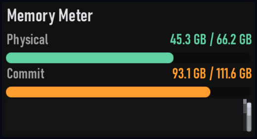

# Memory Meter

Plugin id: `builtin.memory-meter`

## Screenshot



## What it does

Physical memory capacity and use, with 1000-based byte labels. Amber from 70% used, accent red from 85%. Double-click or double-tap raises it to a third of the window.

## Parameters

This widget has no parameters. `settings`, if present, must be `{}`.

```json
{ "plugin": "builtin.memory-meter" }
```
