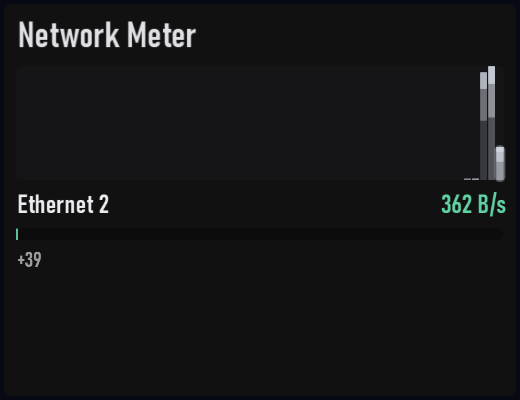

# Network Meter

Plugin id: `builtin.network-meter`

## Screenshot



## What it does

Aggregate throughput plus per-interface rates. Interfaces that stay at 0 B/s for eight samples drop out as idle overflow and return on the first non-zero sample. Extra interfaces show as `+N` at the bottom right; swipe or scroll to page them. Byte rates use 1000-based units (`KB/s`, `MB/s`). Double-click or double-tap raises it to half the window.

## Parameters

| Parameter | Type | Range | Default | Meaning |
| --- | --- | --- | --- | --- |
| `topN` | integer | 1–16 | `8` | How many interface rows to keep |

```json
{ "plugin": "builtin.network-meter", "topN": 8 }
```
