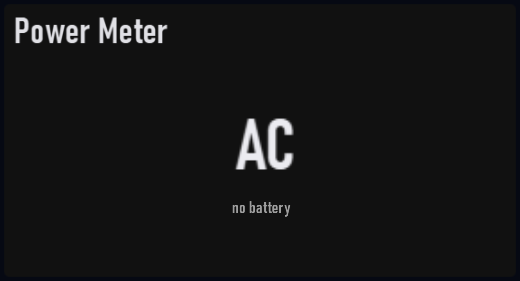

# Power Meter

Plugin id: `builtin.power-meter`

## Screenshot



## What it does

AC vs battery, charge, and sleep capability. An AC-only desktop shows `AC` / `no battery` instead of invented zeros. Battery charge inverts the usual red mapping: a full pack reads healthy. Double-click or double-tap raises it to a third of the window.

## Parameters

This widget has no parameters. `settings`, if present, must be `{}`.

```json
{ "plugin": "builtin.power-meter" }
```
