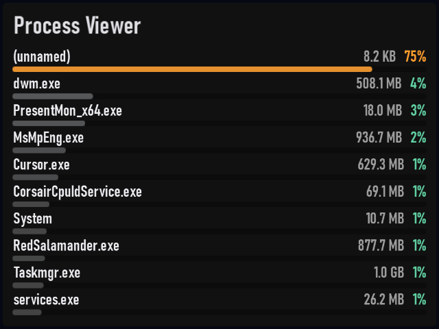

# Process Viewer

Plugin id: `builtin.process-viewer`

## Screenshot



## What it does

Ranks running processes by available CPU, with working set and PID as tie-breakers. Wide tiles split into two columns when the names and stats still fit. Double-click or double-tap raises it to half the window.

It does not collect command lines, full paths, or user names. Inaccessible values show as muted dashes.

## Parameters

| Parameter | Type | Range | Default | Meaning |
| --- | --- | --- | --- | --- |
| `topN` | integer | 1–32 | `10` | How many rows to keep |

```json
{ "plugin": "builtin.process-viewer", "settings": { "topN": 10 } }
```
