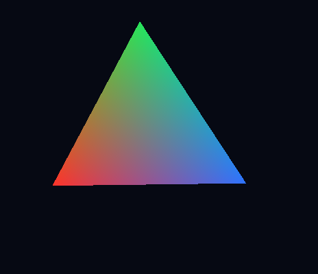

# Rotating Triangle

Plugin id: `builtin.rotating-triangle`

## Screenshot



## What it does

A continuously rotating colored triangle. It is the smallest GPU example on the gallery. Double-click or double-tap raises it to a quarter of the window.

## Parameters

This widget has no parameters. `settings`, if present, must be `{}`.

```json
{ "plugin": "builtin.rotating-triangle" }
```
