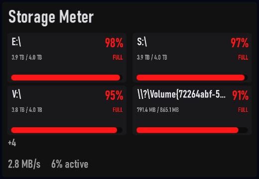

# Storage Meter

Plugin id: `builtin.storage-meter`

## Screenshot



## What it does

Volumes ranked by used percent, then size, as cards with used/total bytes and an OK / HIGH / FULL band. Disk activity is shown when the volume data allows. Double-click or double-tap raises it to a third of the window.

## Parameters

This widget has no parameters. `settings`, if present, must be `{}`.

```json
{ "plugin": "builtin.storage-meter" }
```
