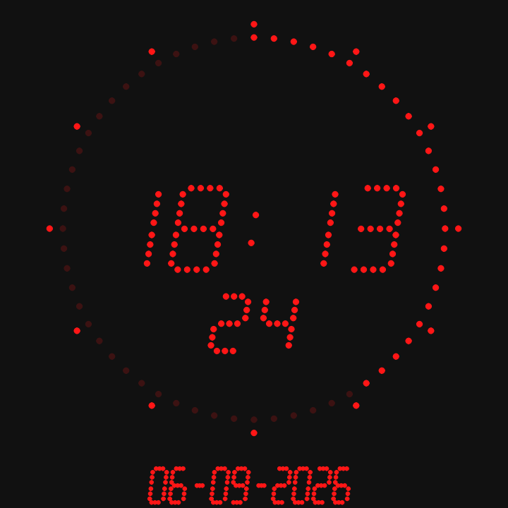

# Studio Clock

Plugin id: `builtin.studio-clock`

## Screenshot



## What it does

A local 24-hour `HH:MM` LED-style clock with an always-lit colon. Optional seconds, a 60-position second ring, and a numeric date sit around that core. Double-click or double-tap raises it to half the window.

## Parameters

Omitted keys take these defaults. Colors are `#RRGGBB`. Unknown keys reject the document.

| Parameter | Type | Values | Default | Meaning |
| --- | --- | --- | --- | --- |
| `showSecondProgress` | boolean | | `true` | Clockwise second ring |
| `externalDotsAlwaysOn` | boolean | | `true` | Keep every five-second companion fully lit; `false` lights only companions up to the current second |
| `showSeconds` | boolean | | `true` | Zero-padded seconds next to the time |
| `secondsColor` | string | `#RRGGBB` | `#FF1616` | Seconds digits and ring |
| `showDate` | boolean | | `false` | Gregorian local date under the clock |
| `dateFormat` | string | `dd-mm-yyyy`, `mm-dd-yyyy`, `yyyy-mm-dd` | `dd-mm-yyyy` | Date order when `showDate` is true |
| `timeColor` | string | `#RRGGBB` | `#FF1616` | Main time (and date) |
| `backgroundColor` | string | `#RRGGBB` | `#111111` | Opaque background |

```json
{
  "plugin": "builtin.studio-clock",
  "showDate": true,
  "dateFormat": "yyyy-mm-dd",
  "externalDotsAlwaysOn": true
}
```
