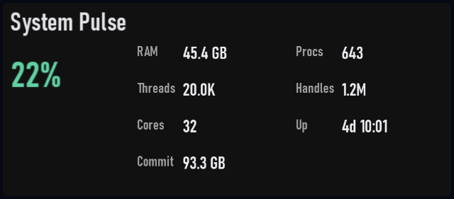

# System Pulse

Plugin id: `builtin.system-pulse`

## Screenshot



## What it does

Machine snapshot: CPU numeral plus RAM, process, thread, handle, core, uptime, and commit chips. Wide tiles pack those chips into two columns. Double-click or double-tap raises it to a quarter of the window.

## Parameters

This widget has no parameters. `settings`, if present, must be `{}`.

```json
{ "plugin": "builtin.system-pulse" }
```
