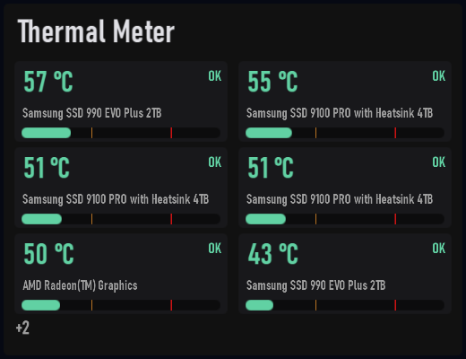

# Thermal Meter

Plugin id: `builtin.thermal-meter`

## Screenshot



## What it does

Temperature and fan cards. Labels are COOL / OK / WARM / HOT from 25 / 70 / 85 °C. Numerals include `°C`. Double-click or double-tap raises it to half the window.

## Parameters

This widget has no parameters. `settings`, if present, must be `{}`.

```json
{ "plugin": "builtin.thermal-meter" }
```
