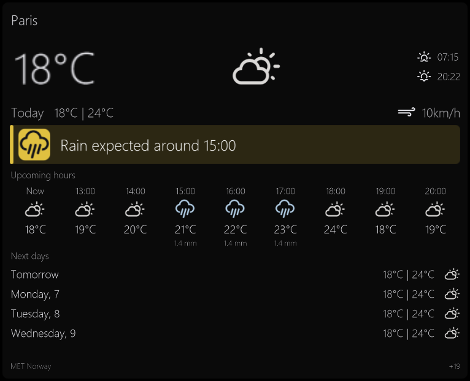

# Weather

Plugin id: `builtin.weather`

## Screenshot



## What it does

Current conditions, today, wind, upcoming hours, and the next local days from public forecast sources (MET Norway, with alert feeds where applicable). A notice such as `Rain expected around HH:MM` appears when a wet hour is due within twelve hours. That notice is a yellow warning banner with a colored weather icon; official alerts use the same banner with a severity-colored warning mark.

A non-empty `location` always wins. City names are looked up once; `lat,lon` is used directly. If lookup of a configured city fails, Weather does not fall back to the PC location.

An empty `location` may use a one-shot Windows location helper. That helper never shows a permission prompt or changes Windows settings. If every source fails, set a city yourself.

The chosen city (or coordinates) is saved for later runs. Hours or days that do not fit show `+N` at the bottom right; swipe or scroll to see them. Double-click or double-tap raises the widget for a taller daily list.

## Parameters

Omitted keys take these defaults. Unknown keys reject the document. `location` is at most 128 characters.

| Parameter | Type | Values | Default | Meaning |
| --- | --- | --- | --- | --- |
| `locationMode` | string | `automatic`, `manual` | `automatic` | Kept for compatibility. A non-empty `location` is authoritative either way |
| `location` | string | city, or `lat,lon` | `""` | Empty allows Windows discovery; non-empty is the configured place |
| `temperatureUnit` | string | `celsius`, `fahrenheit` | `celsius` | Temperature display |
| `windUnit` | string | `kmh`, `mph` | `kmh` | Wind display |

```json
{
  "plugin": "builtin.weather",
  "locationMode": "manual",
  "location": "Lyon, France",
  "temperatureUnit": "celsius",
  "windUnit": "kmh"
}
```
