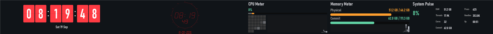

# Global usage

## Install

RedXe ships as a portable ZIP per CPU architecture (`RedXe-<version>-x64-Portable.zip`,
`RedXe-<version>-ARM64-Portable.zip`) on the [releases page](https://github.com/RedSalamanders/RedXe/releases). It
needs Windows 10 version 2004 or later; the Visual C++ runtime is inside the package.

**From the ZIP.** Extract it anywhere and run `RedXe.exe` — that is a complete installation. To get a Start Menu
shortcut, an entry under Settings > Apps, and (optionally) RedXe starting when you sign in, run `install.cmd` from
the extracted folder. It copies the package to `%LocalAppData%\Programs\RedXe`; nothing needs administrator rights.

```powershell
.\install.cmd                              # copy, Start Menu shortcut, Apps entry
.\install.cmd -StartAtSignIn -Launch       # also start at sign-in, then start now
.\Install-RedXe.ps1 -Destination D:\Apps\RedXe
.\Install-RedXe.ps1 -InPlace               # register this folder without copying it
.\uninstall.cmd                            # remove the shortcut, sign-in entry, Apps entry, and the copy
.\uninstall.cmd -PurgeUserData             # also delete %LocalAppData%\RedXe (settings, logs, crash dumps)
```

Running `install.cmd` again with a newer package upgrades the copy in place; your settings under
`%LocalAppData%\RedXe` are never touched by install or uninstall (unless you ask with `-PurgeUserData`). Close RedXe
before installing or removing: a running copy is reported, never killed.

**With winget.**

```powershell
winget install RedSalamanders.RedXe
```

This installs the same package and adds a `RedXe` command to new terminals (`RedXe`, `RedXe --dock bottom`,
`RedXe --help`). winget does not create Start Menu shortcuts for portable packages; to add one, or to start at
sign-in, run `install.cmd` inside the package folder,
`%LocalAppData%\Microsoft\WinGet\Packages\RedSalamanders.RedXe_Microsoft.Winget.Source_8wekyb3d8bbwe` — inside a
winget package the installer registers that folder in place. Upgrade with `winget upgrade RedSalamanders.RedXe`
and remove with `winget uninstall RedSalamanders.RedXe`.

The `RedXe` command is a small launcher (`RedXeLauncher.exe`) that starts `RedXe.exe` from the package folder;
double-clicking `RedXe.exe` itself does the same thing.

## What you see

RedXe fills a XENEON EDGE display with ordered **pages**. Each page is a tree of tiles. Sibling tiles share space by ratio, not by pixel coordinates, so the same layout works in landscape and portrait.

Shipped layouts:

| Build | First page | Other pages |
| --- | --- | --- |
| Release | Full-canvas Matrix Rain | Plugin Gallery, System, then a full-canvas 5H4D3R5 shader slideshow |
| Debug | Development mix | Logicon, Plugin Gallery, System, then a full-canvas 5H4D3R5 shader slideshow |

The first page is selected on every launch. RedXe does not remember which page you were on.

## Window

| Build | With a XENEON (or CORSAIR) display | Without that display |
| --- | --- | --- |
| Release | Borderless fullscreen on that monitor | Yes/No prompt. Yes opens a normal titled window; No exits. |
| Debug | Titled window, 2560×720 design canvas, placed at the XENEON origin | Same titled window with normal Windows placement. No prompt. |

With a `dock` configured (or `--dock` on the command line) both builds run as a bar on a screen edge instead; see [Dock](#dock).

**Escape** or closing the window exits RedXe.

If RedXe stopped after a crash, the next normal launch may offer to open the local crash folder. Dumps stay on this PC; nothing is uploaded.

## Dock

Instead of the window above, RedXe can run as a **bar along one edge of a monitor** — any monitor, not only the XENEON — like a second taskbar. Put a `dock` object in the settings file, or try it for one run from the command line:



```powershell
RedXe.exe --dock bottom@primary
RedXe.exe --dock left@2 --dock-thickness 240 --dock-reserve off
RedXe.exe --dock top@name:DELL --dock-mode autohide --dock-peek 6
RedXe.exe --settings C:\Dash\bar.settings.json --dock none
```

| Setting (`dock`) | Switch | Default | Meaning |
| --- | --- | --- | --- |
| `edge` | `--dock <edge>` | `none` | `top`, `bottom`, `left`, or `right` of the monitor. `none` is the normal window. |
| `monitor` | `--dock <edge>@<monitor>` | `primary` | `primary`, `xeneon`, a display number (`2`), or `name:<part of the display name>` (`name:DELL`, `name:DISPLAY2`). A display that is not connected falls back to the primary. |
| `thickness` | `--dock-thickness` | `180` | How deep the bar is, in DIPs (scaled with the monitor's display scaling; 180 is 270 px at 150 %). 32–1080, at most half the monitor. |
| `mode` | `--dock-mode` | `fixed` | `fixed` keeps the bar on screen. `autohide` collapses it to a few pixels until you point at them. |
| `reserveWorkArea` | `--dock-reserve on\|off` | `true` | `fixed` only. `true`: maximized windows stop at the bar. `false`: the bar floats over the maximized area. |
| `peek` | `--dock-peek` | `4` | `autohide` only: how many pixels stay visible while the bar is collapsed (1–64). |
| `revealDelayMilliseconds` | — | `150` | `autohide` only: how long the pointer must rest on the strip before the bar comes back (0–2000; 0 is immediate). |
| `hideDelayMilliseconds` | — | `800` | `autohide` only: how long after the pointer leaves the bar collapses again (0–10000). |

A switch overrides that one setting for the run, even when you edit the file while RedXe is running. Everything else about the dashboard is unchanged: your pages, swipes, edge chevrons, wheel, raise, and services work in the bar; a left or right bar is simply portrait. Author the pages for the bar's shape — a 180-DIP strip holds a Launcher row, a clock, and a meter comfortably; the shipped XENEON pages are too tall for it:

```json
{
  "version": { "major": 5, "minor": 2 },
  "dock": { "edge": "bottom", "monitor": "primary", "mode": "autohide" },
  "declare": {
    "Launcher": { "plugin": "builtin.launcher", "shortcuts": [], "iconSize": "medium" },
    "Clock": { "plugin": "builtin.desk-clock" }
  },
  "pages": [
    { "columns": [ { "weight": 5, "widget": "Launcher" }, { "weight": 2, "widget": "Clock" } ] }
  ]
}
```

Good to know:

- The bar has no taskbar button and does not take the focus when it starts. To quit, click or tap the bar and press **Escape**, or bind `redxe.quit`.
- **Resize by dragging**: point at the bar's inner edge (the side facing the desktop; the cursor becomes a resize arrow), press, and drag. The bar follows the mouse; when you release, the reserved area follows and the new `thickness` is written to the settings file, so it survives the next start. Works in `fixed` and `autohide` (the bar stays open while you drag); a `--dock-thickness` switch is replaced by the dragged value for that run.
- **Autohide**: rest the mouse on the thin strip at the screen edge and the bar slides back; it collapses again shortly after the pointer leaves and nothing else holds it (a raised widget, a swipe, a text field with the focus, the settings-error dialog). A click or a touch on the strip reveals at once, and a Logicon key or a Launcher tile bound to `redxe.dock.show`, `hide`, or `toggle` does too. If the taskbar sits on the same edge, the strip is just above the taskbar, so aim for that line or use another edge.
- With `reserveWorkArea` off, or in `autohide`, the bar never covers the taskbar; it hugs the edge of the free area.
- A full-screen game or video on that monitor pushes the bar beneath it; it returns when you leave full screen.
- Saving the file re-places the bar for `thickness`, `edge`, `monitor`, `mode`, `reserveWorkArea`, `peek`, and the delays. Turning the dock on or off (`edge` between `none` and an edge) takes effect at the next start; RedXe logs a warning to say so.
- `--screenshot` works for a dock too; an auto-hiding bar is held open for the capture.
- If RedXe crashes while it reserves space, Windows may keep that space reserved until RedXe runs again or you sign out.

## Command line

`RedXe.exe --help` (also `-h`, `/?`, `-?`) prints every switch, grouped, with the exit codes, to the console you ran it from (or to a message box when there is none). Every switch overrides the settings file for that run only; an unknown switch is an error (exit code 2) rather than silently ignored.

| Switch | Meaning |
| --- | --- |
| `--settings <path>` | Use one portable settings file instead of the one under `%LocalAppData%\RedXe\Settings`; its `Logs` folder sits beside it. |
| `--warp` | Render on the Microsoft Basic Render Driver (WARP) instead of the GPU. |
| `--dock <edge>[@<monitor>]` | Run as a bar on that screen edge; see [Dock](#dock) for `--dock-mode`, `--dock-thickness`, `--dock-reserve`, and `--dock-peek`. |
| `--screenshot <png>` | Start normally, wait, save the window as PNG, and exit; see [Screenshots](#screenshots) for `--page`, `--widget`, and `--after`. |
| `--self-test` | Hidden startup validation with the deployed template; exits 0 when the host works. |
| `--crash-test`, `--crash-test-stack-overflow`, `--crash-test-directory=<dir>` | Raise a test crash and choose where its dump goes (used by `test.ps1`). |

Exit codes: 0 ok, 1 settings, 2 command line or window, 3 plugins, 5 graphics, 7 settings watcher, 8 screenshot capture.

## Screenshots

`RedXe.exe --screenshot <file.png> [--page <id>] [--widget <ordinal>] [--after <milliseconds>]` starts the dashboard as usual, jumps to that page (default: the start page), waits for the delay (default 3000 ms, so widgets and devices have settled), saves its own window — or only the widget at that 0-based position on the page — as a PNG through Windows.Graphics.Capture, and exits. It never takes the focus or moves the mouse. Combine it with `--settings` for a repeatable scene; the exit code is 0 when the file was written and 8 when the capture failed. The pictures under `docs/screenshots/` are produced this way.

## Pages

Swipe **left** with **two or three fingers** to go forward, **right** to go back. Navigation is always horizontal, including in portrait. One finger stays with the tile (for example AV Control sliders, or Launcher's own pages). A second finger does not steal a slider until the two-finger swipe actually starts (moves sideways). A pen does not change dashboard pages.

With a **mouse**, hover the left or right edge of the window. A chevron appears when that direction has a neighbor. Click it to change page.

The **mouse wheel** changes pages too: roll **down** (or tilt the wheel **right**, or two-finger swipe right on a precision touchpad) to go forward, **up** or **left** to go back. One notch is one page. A tile that shows page dots keeps the wheel for itself — Launcher pages its icons, Process Viewer and the other System Data meters page their extra rows, Weather pages its forecast hours or days — and at its last page a further notch simply does nothing; the dashboard never changes page under it. To change the dashboard page with the wheel, point at a tile without page dots (a clock, Matrix Rain, a list that fits) or use the edge chevrons.

Every tile with pages of its own shows the same **page control**: a row of dots, one per page, with the current page brighter and larger. Tap a dot to jump to that page, or swipe with one finger, or use the wheel. A `+N` mark, where one still appears, counts items that are not on any page (idle network adapters, sensors that do not fit a very small tile).

By default you stop at the first and last page. Set `"wrapPages": true` in settings to wrap from either end.

Double-click or double-tap a tile that does not already fill the window to **raise** it. Close, Escape, or a second double-activate restores it. You cannot swipe dashboard pages while a widget is raised.

A tile that failed to load stays in place as a host placeholder. Other tiles on the page keep working.

## Settings file

Without `--settings`, RedXe uses one editable file:

| Build | Path |
| --- | --- |
| Debug | `%LocalAppData%\RedXe\Settings\RedXe-debug.settings.json` |
| Release | `%LocalAppData%\RedXe\Settings\RedXe.settings.json` |

Save the file to apply it. RedXe watches that path; you do not restart. A valid document keeps the page you were on when that page still exists. An invalid save leaves the last good dashboard running and shows one error dialog with the JSON path and the reason (and line and column when those are known). Dismissing the dialog suppresses only that failed save; a later distinct invalid save can prompt again.

If the default file is missing, RedXe installs the shipped template and continues. If it is invalid, RedXe copies the bytes beside it as `<stem>.invalid-YYYY-MM-DD_HH-MM-SSZ.json`, installs a fresh template, and tells you where the backup went.

`--settings <path>` uses one portable file instead. A missing or invalid portable file is not rewritten; RedXe reports the problem and runs the shipped default in memory.

Host fields you typically edit:

| Field | Default | Meaning |
| --- | --- | --- |
| `wrapPages` | `false` | Wrap page navigation at the ends |
| `logRetentionDays` | `15` | UTC days of JSONL logs to keep (1–365) under `%LocalAppData%\RedXe\Logs\` |
| `backgroundColor` | `#000000` | Background of the whole dashboard: the canvas and every widget tile (`#RRGGBB`) |
| `declare` | shipped names | Reusable widget definitions (`plugin` plus flattened keys) |
| `services` | `Logicon` | Background services that run with the dashboard, such as the [Logicon](plugins/logicon.md) keypad service |
| `dock` | off | Run RedXe as a bar on a screen edge instead of a window; see [Dock](#dock) |
| `pages` | 1–16 | Ordered pages. Optional `name` is the label; omitted names display as `Page N` |

This build reads `"version": { "major": 5 }` only (minor `1` adds `services`, minor `2` adds `dock`; older minors still load). A leftover version 4 file is invalid: the default path is backed up and replaced with the shipped template; `--settings` leaves the portable file alone.

A page uses exactly one of `widgets`, `columns`, or `rows` (or none, for a blank page). `columns` split along the long side of the window, `rows` along the short side. Omitted `weight` is 1. `widgets` is an equal-share list (omitted `along` is `long-side`). Nested `rows` inside `columns` stack tiles in a column.

```json
{
  "version": { "major": 5 },
  "declare": {
    "Matrix": { "plugin": "builtin.matrix-rain" },
    "Launcher": { "plugin": "builtin.launcher", "shortcuts": [] }
  },
  "pages": [
    { "name": "Main", "widgets": ["Matrix"] },
    {
      "name": "Mix",
      "columns": [
        { "weight": 2, "rows": ["Launcher", "Matrix"] },
        { "weight": 5, "widget": { "use": "Matrix", "seed": 4242 } }
      ]
    }
  ]
}
```

Widgets are named in `declare` and referenced by that name, written as a `builtin.*` plugin id, written inline as `{ "plugin": "...", ...keys }`, or reused with `{ "use": "<name>", ...keys }`. Extra keys on a use-object merge: objects merge, scalars and arrays replace. Do not nest a `settings` object and do not write `layout` / `areas`.

## Background color

Every tile shares the document `backgroundColor` (default `#000000`), so a page reads as one surface. Change it at the root of the file to recolor the whole dashboard:

```json
{
  "version": { "major": 5 },
  "backgroundColor": "#101418",
  "pages": [{ "widgets": ["Matrix"] }]
}
```

To give one widget its own background, put `backgroundColor` on that widget object. It works for every widget, in `declare`, inline, or on a use-object (`null` on a use-object goes back to the document color):

```json
{
  "declare": { "Clock": { "plugin": "builtin.studio-clock", "backgroundColor": "#111111" } },
  "pages": [
    { "widgets": ["Clock", { "use": "Clock", "backgroundColor": null }, { "plugin": "builtin.weather", "backgroundColor": "#0A0A0A" }] }
  ]
}
```

Every settings-visible widget is documented under [plugins](plugins/README.md).
